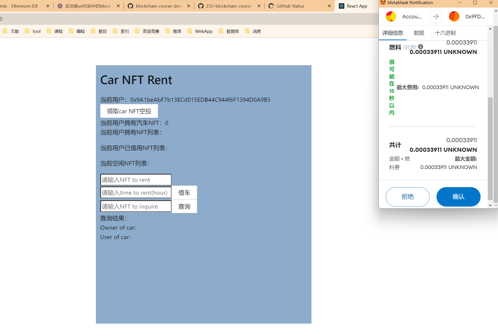
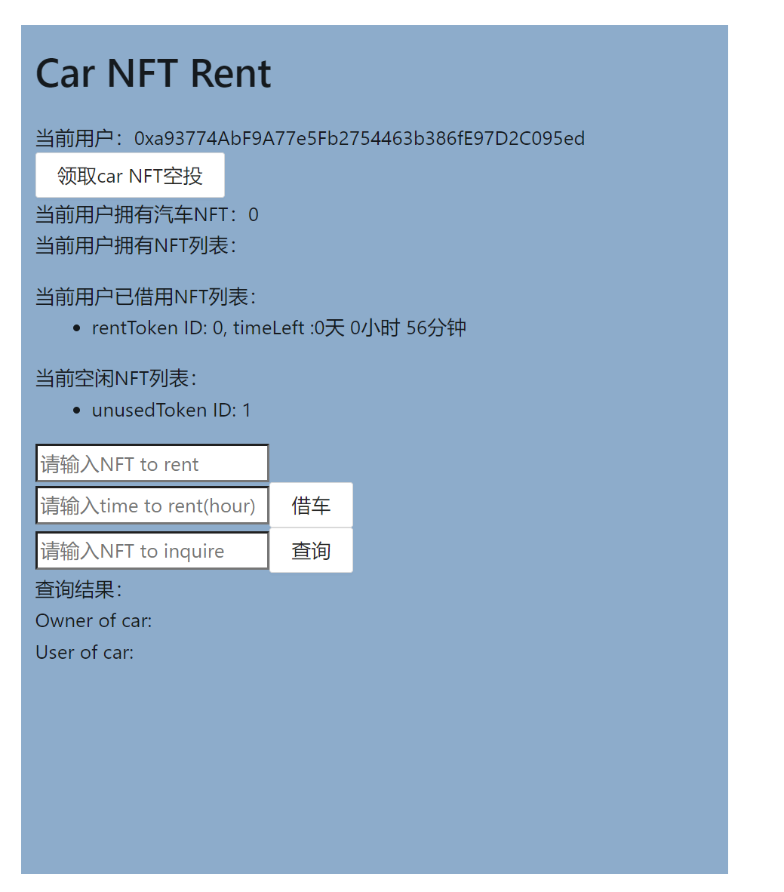

# ZJU-blockchain-course-2023

⬆ 可以️修改成你自己的项目名。

> 第二次作业要求（以下内容提交时可以删除）：
>
> 简易汽车借用系统，参与方包括：汽车拥有者，有借用汽车需求的用户
>
> 背景：ERC-4907 基于 ERC-721 做了简单的优化和补充，允许用户对NFT进行租借。
> - 创建一个合约，在合约中发行NFT集合，每个NFT代表一辆汽车。给部分用户测试领取部分汽车NFT，用于后面的测试。
> - 在网站中，默认每个用户的汽车都可以被借用。每个用户可以：
>    1. 查看自己拥有的汽车列表。查看当前还没有被借用的汽车列表。
>    2. 查询一辆汽车的主人，以及该汽车当前的借用者（如果有）。
>    3. 选择并借用某辆还没有被借用的汽车一定时间。
>    4. 上述过程中借用不需要进行付费。
>
> - （Bonus）使用自己发行的积分（ERC20）完成付费租赁汽车的流程
> - 请大家专注于功能实现，网站UI美观程度不纳入评分标准，但要让用户能够舒适操作。简便起见，可以在网上找图片代表不同汽车，不需要将图片在链上进行存储。

**以下内容为作业仓库的README.md中需要描述的内容。请根据自己的需要进行修改并提交。**

作业提交方式为：**提交视频文件**和**仓库的链接**到指定邮箱。

## 如何运行

补充如何完整运行你的应用。

1. 在本地启动ganache应用。

2. 在 `./contracts` 中安装需要的依赖，运行如下的命令：
    ```bash
    npm install
    ```
3. 在 `./contracts` 中编译合约，运行如下的命令：
    ```bash
    npx hardhat compile
    将ganache相关url和账户放入hardhat.config.tx
    npx hardhat run ./scripts/deploy.ts
    将artifacts文件下的abi文件复制到/frontend/utils/abis当中
    将MyERC4907所被部署在的地址复制到/frontend/utils/contract-addresses.json当中
    ```
4. ...
5. ...
6. 在 `./frontend` 中安装需要的依赖，运行如下的命令：
    ```bash
    npm install
    ```
7. 在 `./frontend` 中启动前端程序，运行如下的命令：
    ```bash
    npm run start
    ```
8. 在前端点击连接钱包，连接ganache，导入ganache账户即可进行操作

## 功能实现分析

简单描述：项目完成了要求的哪些功能？每个功能具体是如何实现的？
>    1. 查看自己拥有的汽车列表。查看当前还没有被借用的汽车列表。
>    前端通过useEffect函数在刷新时调用MyERC4907合约中的getTokensByOwner方法来获取当前用户拥有的汽车列表。
>    前端通过useEffect函数在刷新时调用MyERC4907合约中的getUnusedTokenIds方法来获取还没有被借用的汽车列表。
>    2. 查询一辆汽车的主人，以及该汽车当前的借用者（如果有）。
>    前端通过input组件获取用户输入要查询的汽车TokenID,在button的回调函数中调用ERC4907的ownerOf的方法来查询其主人，调用MyERC4907的MyUserOf方法来查询其借用者。
>    3. 选择并借用某辆还没有被借用的汽车一定时间。
>    前端通过input组件获取用户输入要借用的汽车TokenID,借用的时间(小时)，在button的回调函数中调用MyERC4907的RentCar的方法来进行借用
>    4. 上述过程中借用不需要进行付费。

## 项目运行截图

放一些项目运行截图。
项目运行成功的关键页面和流程截图。主要包括操作流程以及和区块链交互的截图。
1.连接钱包后

2.获取一个NFT空投


刷新后查看空闲NFT列表和用户拥有NFT列表(这里我申请空投了两次)

3.切换另一个用户，借用刚才第一个用户空投得到的NFT 0，借用时间为1小时


刷新列表后显示当前用户正在借用的车辆和剩余的借用时间

4.查看NFT 0的主人和借用者

查看NFT 1的主人和借用者


## 参考内容

- 课程的参考Demo见：[DEMOs](https://github.com/LBruyne/blockchain-course-demos)。

- ERC-4907 [参考实现](https://eips.ethereum.org/EIPS/eip-4907)

如果有其它参考的内容，也请在这里陈列。
